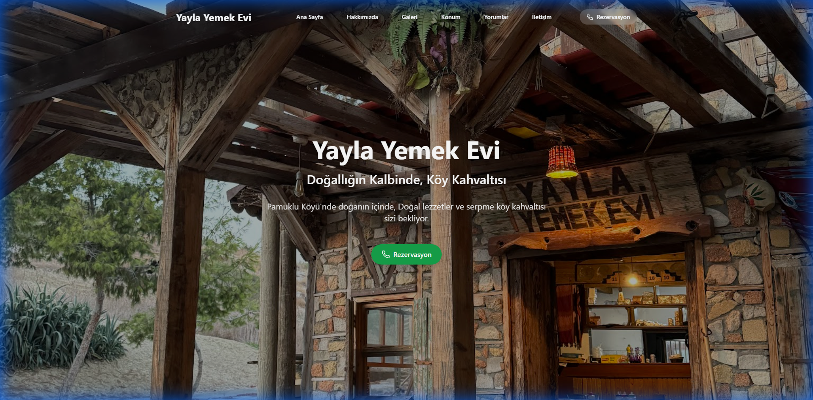

# 🌿 Yayla Yemek Evi

<div align="center">
  
</div>

<div align="center">

**Doğallığın Kalbinde, Köy Kahvaltısı**

[](https://reactjs.org/)
[](https://www.typescriptlang.org/)
[](https://vitejs.dev/)
[](https://tailwindcss.com/)

</div>

---

## 📖 Proje Hakkında

**Yayla Yemek Evi**, Pamuklu Köyü, İskele, Kuzey Kıbrıs'ta bulunan otantik bir köy restoranının modern ve responsive web sitesidir. 2018 yılından beri doğal ürünler ve geleneksel lezzetlerle hizmet veren restoranımızın dijital vitrini olarak tasarlanmıştır.

## ✨ Özellikler

- 🎨 **Modern ve Duyarlı Tasarım** - Tüm cihazlarda mükemmel görünüm
- 🖼️ **İnteraktif Galeri** - Restoranın atmosferini yansıtan görsel galeri
- 📍 **Konum Entegrasyonu** - Google Maps ile detaylı konum bilgisi
- 💬 **Müşteri Yorumları** - Misafir deneyimlerini gösteren referans bölümü
- 📱 **Hızlı İletişim** - Tek tıkla rezervasyon ve iletişim özellikleri
- ⚡ **Yüksek Performans** - Vite ile optimize edilmiş yapı
- 🎯 **SEO Optimizasyonu** - Arama motorları için optimize edilmiş içerik

## 🛠️ Teknoloji Yığını

#### Frontend Framework & Kütüphaneler
- **React** 18.3.1 - Modern UI geliştirme
- **TypeScript** 5.5.3 - Tip güvenli kod yazımı
- **Vite** 5.4.2 - Hızlı geliştirme ve build aracı

#### Styling & UI
- **Tailwind CSS** 3.4.1 - Utility-first CSS framework
- **Lucide React** 0.344.0 - Modern icon kütüphanesi
- **PostCSS** & **Autoprefixer** - CSS işleme

#### Development Tools
- **ESLint** - Kod kalitesi ve tutarlılık
- **TypeScript ESLint** - TypeScript için linting
- **React Hooks ESLint** - React Hooks için best practices


## 📜 Mevcut Scriptler

```json
{
  "dev": "vite",                    // Geliştirme sunucusu
  "build": "vite build",            // Production build
  "lint": "eslint .",               // Kod kalitesi kontrolü
  "preview": "vite preview"         // Build önizleme
}
```

## 🎨 Bileşenler

| Bileşen | Açıklama |
|---------|----------|
| **Navbar** | Responsive navigasyon menüsü, mobil hamburger menu |
| **Hero** | Ana sayfa hero section, rezervasyon butonu |
| **About** | Restoran hikayesi ve değerler |
| **Gallery** | Görsel slider ve resim galerisi |
| **Location** | Google Maps entegrasyonu ve adres bilgileri |
| **Reviews** | Müşteri yorumları ve değerlendirmeler |
| **Contact** | İletişim formu ve sosyal medya linkleri |

## 📱 Responsive Tasarım

Web sitesi tüm cihaz boyutları için optimize edilmiştir:
- 📱 **Mobil**: 320px - 767px
- 📱 **Tablet**: 768px - 1023px
- 💻 **Desktop**: 1024px ve üzeri

## 🌐 SEO Optimizasyonu

- ✅ Semantic HTML5 yapısı
- ✅ Meta descriptions ve keywords
- ✅ Open Graph protokolü desteği
- ✅ Hızlı sayfa yükleme süreleri
- ✅ Mobile-first yaklaşım
- ✅ Optimize edilmiş görseller

Katkılarınızı bekliyoruz! 🤝

## 📄 Lisans

Bu proje özel bir proje olup, tüm hakları saklıdır.

## 📞 İletişim

**Yayla Yemek Evi**
- 📍 Adres: Pamuklu Köyü, İskele, Kuzey Kıbrıs
- 📱 Telefon: +90 533 847 10 10
- 🌐 Web: [yaylayemekevi.com](https://yaylayemekevi.com)

---

<div align="center">

**Geleneksel lezzetleri korumak için ❤️ ile geliştirildi**

*Yayla Yemek Evi - Doğa ve Gelenek Buluşuyor*

</div>
